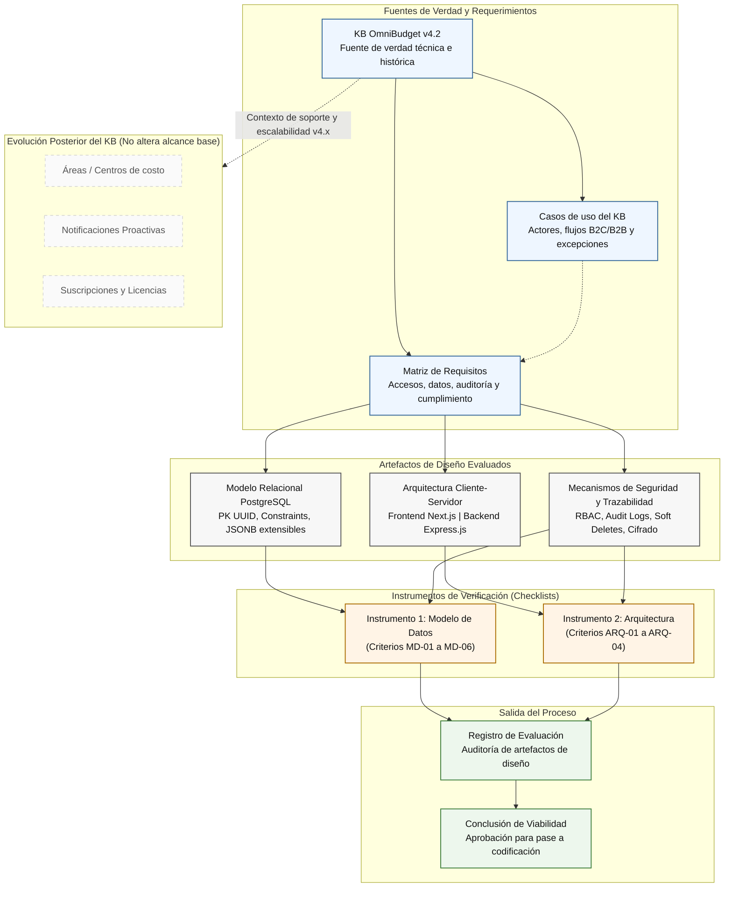

# **Technical Knowledge Base (KB): OmniBudget Platform**

**Version:** 4.4 (Jerarquía)
**Date:** May 14, 2026

### **Version History:**
*   **v1.0 & v2.0:** Exploración inicial, definición de stack tecnológico (Next.js, Express, PostgreSQL) y modelos conceptuales básicos.
*   **v3.0:** Integración de modelo B2B/B2C unificado vía `Workspaces`, manejo de licencias (Source-Available/Freemium), motor de auditoría (`Audit Logs`), tipos de transacciones avanzadas (`Financial Nature`), metadatos extensibles (`JSONB`), cierres contables (`Reconciliation`), y cumplimiento legal de retención de datos (`Soft Deletes`).
*   **v3.1:** Expansión arquitectónica (Incremental). Adición de entidades para soporte del modelo de negocio SaaS (Suscripciones), sistema de Notificaciones Proactivas (Fase 2) y manejo de Impuestos/Soportes para cumplimiento B2B Enterprise (Fase 4).
*   **v4.0** Adición de areas (funcionalidad sub-workspaces).
*   **v4.1** Adición de historias de usuario, y requerimentos funcionales y no funcionales.
*   **v4.2** Adición de diagrama de casos de uso.
*   **v4.3** Incorporación de la sección de Validación y Evaluación de Artefactos (Metodología de verificación, checklists de calidad y trazabilidad de diseño para el pase a fase de codificación).
*   **v4.4** **actual** Adición de cuentas jerarquicas para multiples divisas.

---

## **1. Identidad del Producto y Filosofía Técnica (Internal Context)**

OmniBudget es una plataforma web y de automatización financiera orientada a consolidar el ecosistema de gestión monetaria (B2C y B2B). Se posiciona en el espacio intermedio entre hojas de cálculo (muy manuales) y ERPs tradicionales (muy complejos).

**Principios Rectores de Ingeniería:**
1.  **Opciones y Baja Fricción:** El sistema automatiza (API Sync, CSV parsing) pero asume que el usuario tiene la última palabra (`pending_review`).
2.  **Unificación B2B/B2C:** Por defecto, una pequeña empresa (B2B) y un individuo (B2C) usan **exactamente la misma plataforma y UI**. Las modificaciones estructurales, tablas extra o UI personalizadas ocurren **únicamente** cuando un cliente corporativo (o individuo complejo) paga por el servicio de consultoría/personalización. Para soportar esto sin romper el *core*, usamos campos extensibles (`JSONB`).
3.  **Trazabilidad y Transparencia:** Todo cambio en el estado financiero deja una huella inmutable (`Audit Logs`).
4.  **Agnosticismo de Idioma:** La UI es agnóstica (`i18n`). El backend procesa todo en inglés y entrega *keys* que el frontend traduce.
5.  **Source-Available & Freemium:** El software base puede ser ejecutado localmente por los usuarios (*self-hosting*). Los servicios de conveniencia (Sincronización API Bancaria Automática) requieren validación de licencia contra nuestra nube.

---

## **2. System Architecture & Tech Stack**

La arquitectura sigue un modelo Cliente-Servidor con separación estricta de responsabilidades. **Toda la capa técnica, bases de datos, variables y endpoints están estandarizados en inglés.**

*   **Frontend (Presentation Layer): Next.js (React).** 
    *   Maneja la lógica de UI y el motor de internacionalización (`next-i18next`). Consume diccionarios JSON (ej. `es.json`, `en.json`) usando *keys* enviadas por el backend (ej. `category.vital_expenses`).
*   **Backend (Business Logic Layer): Express.js (Node.js).** 
    *   API RESTful. Implementa una arquitectura orientada a servicios (OOP). Los controladores delegan la lógica pesada a servicios (ej. `ReconciliationService`, `AuditService`).
*   **Database (Persistence Layer): PostgreSQL.** 
    *   Motor relacional estricto con propiedades ACID. Uso intensivo de Constraints, Foreign Keys y campos `JSONB` para extensibilidad.

---

## **3. Lógica de Negocio y Flujos Técnicos Centrales**

### **3.1. Logical Isolation (Workspaces)**
Para unificar usuarios normales y empresas sin duplicar la base de datos, usamos `Workspaces`. Un `User` (individuo autenticado) puede pertenecer a múltiples `Workspaces` (ej. "Mis Finanzas Personales", "Empresa Familiar LLC"). El acceso a cuentas, bancos y presupuestos está delimitado estrictamente por el `Workspace`, gestionado mediante RBAC (Role-Based Access Control).

### **3.2. Data Ingestion & Fallbacks**
La creación de transacciones (`transactions`) tiene tres orígenes (`origin`):
1.  **`api_sync`:** Vía proveedores Open Banking (Plaid, Belvo). Requiere validación de `license_key`.
2.  **`csv_import`:** Fallback crítico. El sistema parsea archivos del banco y detecta duplicados matemáticamente.
3.  **`manual`:** Ingreso directo por el usuario.

### **3.3. Financial Nature & Accuracy**
No basta con "Ingreso" o "Gasto". El sistema distingue la naturaleza real del dinero para no inflar reportes. Un `refund` (reembolso) cancela un gasto previo, no cuenta como ingreso neto. Un `transient_fund` (dinero prestado) se excluye de la utilidad neta.

### **3.4. Reconciliation (Cierres Contables)**
Los bancos y el software pueden desfasarse. El sistema permite generar `account_snapshots` (ej. a final de mes). Si el usuario reporta que en el banco hay $1000, pero el sistema dice $950, se genera una transacción automática de ajuste para garantizar que el saldo inicial del próximo mes sea perfecto.

### **3.5. Proactive Notifications System**
El sistema no solo es reactivo, sino proactivo. Un motor en *background* (CRON jobs / Workers) evalúa anomalías (ej. posible transacción duplicada detectada, presupuesto excedido en un 90%, sincronización bancaria fallida) y deposita alertas en el centro de notificaciones, respetando las preferencias de canales del usuario (In-App, Email, Push).

### **3.6. Entitlements & SaaS Billing**
Para soportar el modelo Freemium y B2B, la tabla `workspaces` delega el control de acceso a una nueva entidad de suscripciones. Si la suscripción expira, el *Workspace* entra en modo "Read-Only" (Freemium degradado) deshabilitando el `api_sync` pero permitiendo el `csv_import`, garantizando que el usuario jamás pierda acceso a sus datos históricos.


---

## **4. Relational Database Schema (PostgreSQL)**

El modelo está normalizado y preparado para cumplimiento legal (uso de `deleted_at` para Soft Deletes, preservando la integridad referencial).

### **A. Core, Identity & Licensing**
*   **`users`**
    *   `id` (UUID, PK)
    *   `email` (VARCHAR, UNIQUE)
    *   `password_hash` (VARCHAR)
    *   `locale` (VARCHAR) -> *e.g., 'es-CO', 'en-US'*
    *   `created_at` (TIMESTAMP)
    *   `deleted_at` (TIMESTAMP, NULLABLE) -> *Soft delete para cumplimiento de privacidad.*
    *   `notification_preferences` (JSONB) -> *Configuración de opt-in/opt-out para emails o push (ej. {"email_alerts": true, "push_budget": false}). Requerido para cumplimiento Anti-Spam.*
*   **`workspaces`**
    *   `id` (UUID, PK)
    *   `name` (VARCHAR) -> *e.g., "John's Home", "Acme Corp"*
    *   `type` (ENUM: 'personal', 'business')
    *   `base_currency` (VARCHAR(3))
    *   `license_key` (VARCHAR, NULLABLE) -> *Valida si el Workspace tiene acceso a premium features.*
    *   `created_at` (TIMESTAMP)
*   **`workspace_users`** (Pivot Table for RBAC)
    *   `workspace_id` (UUID, FK)
    *   `user_id` (UUID, FK)
    *   `role` (ENUM: 'owner', 'admin', 'editor', 'viewer')

### **B. Accounts, Sync & Reconciliation**
*   **`bank_connections`**
    *   `id` (UUID, PK)
    *   `workspace_id` (UUID, FK)
    *   `institution_name` (VARCHAR)
    *   `api_token` (VARCHAR, ENCRYPTED)
    *   `sync_status` (ENUM: 'active', 'error', 'disconnected')
*   **`accounts`**
    *   `id` (UUID, PK)
    *   `workspace_id` (UUID, FK)
    *   `bank_connection_id` (UUID, FK, NULLABLE)
    *   `parent_account_id` (UUID, FK, NULLABLE) -> *Patrón de Bolsillos (Pockets). Permite anidar sub-cuentas multidivisa bajo una cuenta principal.*
    *   `name` (VARCHAR) -> *ej. "Cuenta Wise" (Padre) o "Bolsillo EUR" (Hijo).*
    *   `type` (ENUM: 'cash', 'checking', 'savings', 'credit', 'container') -> *El tipo 'container' se usa para cuentas padre que solo agrupan divisas.*
    *   `currency` (VARCHAR(3), NULLABLE) -> *Estándar ISO 4217. Debe ser NULL si el type es 'container'. Requerido si es un bolsillo transaccional.*
    *   `is_system_default` (BOOLEAN) -> *Protege la cuenta "Cash" inicial de ser borrada.*
    *   `deleted_at` (TIMESTAMP, NULLABLE)
*   **`account_snapshots`** (Reconciliation Engine)
    *   `id` (UUID, PK)
    *   `account_id` (UUID, FK)
    *   `statement_date` (DATE)
    *   `reported_balance_cents` (BIGINT) -> *Saldo reportado por el banco, en unidad menor (centavos).*
    *   `system_balance_cents` (BIGINT) -> *Saldo calculado por OmniBudget, en unidad menor.*
    *   `is_reconciled` (BOOLEAN)

### **C. Ledger, Categorization & Extensibility**
*   **`areas`**
    *   `id` (UUID, PK)
    *   `workspace_id` (UUID, FK)
    *   `parent_area_id` (UUID, FK, NULLABLE) -> *Permite jerarquías como "Ventas" -> "Ventas Latam".*
    *   `name` (VARCHAR) -> *e.g., "Marketing", "Proyecto Alpha", "Casa de Verano" (para uso B2C).*
*   **`categories`**
    *   `id` (UUID, PK)
    *   `workspace_id` (UUID, FK, NULLABLE) -> *NULL = Global system category.*
    *   `parent_category_id` (UUID, FK, NULLABLE)
    *   `name_key` (VARCHAR) -> *For i18n translation.*
    *   `metadata` (JSONB) -> *Para campos customizados de clientes B2B.*
*   **`transactions`** (The Single Source of Truth)
    *   `id` (UUID, PK)
    *   `account_id` (UUID, FK)
    *   `category_id` (UUID, FK, NULLABLE)
    *   `type` (ENUM: 'income', 'expense', 'transfer')
    *   `financial_nature` (ENUM: 'real_income', 'real_expense', 'refund', 'transient_fund')
    *   `amount_cents` (BIGINT) -> *Valor absoluto en la unidad menor de la moneda (evita errores de coma flotante en Node.js).*
    *   `currency` (VARCHAR(3)) -> *Estándar ISO 4217 de la transacción.*
    *   `transaction_date` (TIMESTAMP)
    *   `description` (TEXT)
    *   `origin` (ENUM: 'manual', 'api_sync', 'csv_import')
    *   `status` (ENUM: 'pending_review', 'confirmed') -> *Permite la automatización asistida.*
    *   `duplicate_flag` (BOOLEAN) -> *Detectado por algoritmos internos.*
    *   `metadata` (JSONB) -> *Guarda datos crudos del banco o campos custom B2B (ej. Centro de Costos).*
    *   `deleted_at` (TIMESTAMP, NULLABLE)
    *   `attachment_url` (VARCHAR, NULLABLE) -> *Ruta al S3 bucket con la foto del recibo/factura (Crítico para auditorías B2B).*
    *   `tax_amount_cents` (BIGINT, DEFAULT 0) -> *Monto de impuestos (ej. IVA/VAT) separado del monto base para reportes fiscales Fase 4.*
    *   `area_id` (UUID, FK, NULLABLE) -> *Opcional. ¿A qué departamento/proyecto pertenece este gasto?*

### **D. Trust & Security (Audit)**
*   **`audit_logs`**
    *   `id` (UUID, PK)
    *   `workspace_id` (UUID, FK)
    *   `entity_name` (VARCHAR) -> *e.g., 'transaction', 'budget'*
    *   `entity_id` (UUID)
    *   `changed_by_user_id` (UUID, FK, NULLABLE) -> *NULL si fue el sistema (API Sync).*
    *   `action` (ENUM: 'created', 'updated', 'deleted', 'classified')
    *   `old_values` (JSONB)
    *   `new_values` (JSONB)
    *   `timestamp` (TIMESTAMP)

### **E. Hierarchical Budgeting Engine**
*   **`budgets`**
    *   `id` (UUID, PK)
    *   `workspace_id` (UUID, FK)
    *   `parent_budget_id` (UUID, FK, NULLABLE) -> *Para reglas como 50/30/20.*
    *   `name` (VARCHAR)
    *   `amount_limit_cents` (BIGINT) -> *Límite del presupuesto en unidad menor.*
    *   `currency` (VARCHAR(3)) -> *Moneda base en la que se evalúa el presupuesto.*
    *   `period` (ENUM: 'weekly', 'monthly', 'yearly', 'custom')
    *   `start_date` (DATE)
    *   `end_date` (DATE, NULLABLE)
    *   `alert_threshold` (DECIMAL(5,2), DEFAULT 80.00) -> *Aquí sí se usa DECIMAL porque es un porcentaje exacto.*
    *   `area_id` (UUID, FK, NULLABLE) -> *Opcional. Permite crear un presupuesto específico cruzando Categoría + Área.*
*   **`budget_categories`** (M:N Pivot)
    *   `budget_id` (UUID, FK)
    *   `category_id` (UUID, FK)

### **F. Subscriptions & SaaS Billing (Monetization Engine)**
Para gestionar la separación entre usuarios Freemium, Premium (SaaS) y Enterprise.
*   **`subscriptions`**
    *   `id` (UUID, PK)
    *   `workspace_id` (UUID, FK, UNIQUE)
    *   `plan_type` (ENUM: 'free', 'premium', 'enterprise')
    *   `provider` (ENUM: 'stripe', 'paypal', 'apple', 'manual')
    *   `provider_subscription_id` (VARCHAR, NULLABLE)
    *   `status` (ENUM: 'active', 'past_due', 'canceled', 'trialing')
    *   `current_period_end` (TIMESTAMP)
    *   `created_at` (TIMESTAMP)
*   **`invoices`** (Historial de cobros de OmniBudget a sus clientes)
    *   `id` (UUID, PK)
    *   `workspace_id` (UUID, FK)
    *   `amount_paid_cents` (BIGINT) -> *Cobro en centavos.*
    *   `currency` (VARCHAR(3)) -> *Estándar ISO 4217.*
    *   `invoice_pdf_url` (VARCHAR)
    *   `paid_at` (TIMESTAMP)

### **G. Proactive Notifications & Alerts**
El centro de notificaciones in-app.
*   **`notifications`**
    *   `id` (UUID, PK)
    *   `workspace_id` (UUID, FK) -> *A qué entorno pertenece la alerta.*
    *   `user_id` (UUID, FK, NULLABLE) -> *Si es NULL, la alerta es para todos los admins del workspace.*
    *   `type` (ENUM: 'duplicate_alert', 'budget_warning', 'sync_error', 'system_update')
    *   `message_key` (VARCHAR) -> *Para internacionalización (i18n), ej: 'notifications.budget_exceeded'.*
    *   `context_data` (JSONB) -> *IDs relacionados (ej. el ID de la transacción duplicada).*
    *   `is_read` (BOOLEAN, DEFAULT FALSE)
    *   `created_at` (TIMESTAMP)


> **ARCHITECTURAL NOTE: Multi-Currency & The Pocket Pattern**
> Para resolver el manejo de cuentas multidivisa reales (Neo-bancos como Wise, Revolut), se implementa el **Patrón de Bolsillos (Sub-cuentas)**:
> 1. **Jerarquía:** Se crea una cuenta padre con `type = 'container'` y `currency = NULL`. Dentro de esta, se crean cuentas hijas vinculadas mediante `parent_account_id`, cada una con su `currency` estricta (ej. USD, EUR).
> 2. **Transaccionalidad Estricta:** La tabla `transactions` **jamás** debe apuntar a una cuenta padre ('container'). Toda transacción debe registrarse en la cuenta hija, garantizando que el `amount_cents` coincida matemáticamente con la `currency` del bolsillo, protegiendo así el motor de conciliación (`account_snapshots`).

---

## **5. Cumplimiento, Privacidad y Reglas Críticas (Legal & Compliance)**

Como plataforma que procesa información financiera (y se proyecta a B2B con regulaciones estrictas), el equipo de ingeniería debe acatar estas reglas a nivel de código:

1.  **Regla de Anonimización (Habeas Data/GDPR):** 
    Cuando un usuario invoca su derecho al olvido (borrar cuenta), se activa un *Job* de background. 
    *   Si el usuario era el único en un `Workspace` B2C, se ejecuta un *hard delete* de todas sus transacciones tras 30 días.
    *   Si el usuario pertenecía a un `Workspace` compartido (Empresa/Familia), se elimina su registro de `users` (se ofusca el email y nombre), pero **no** se borran las transacciones que él haya ingresado (`transactions`), garantizando que la empresa no pierda su contabilidad histórica.
2.  **Protección de Secretos Bancarios:**
    Los `api_token` de `bank_connections` jamás deben ser enviados al Frontend. Se cifran en reposo utilizando AES-256 en la base de datos (PostgreSQL `pgcrypto` o mediante KMS en la capa de aplicación Node.js).
3.  **Inmutabilidad Asistida:**
    Cualquier actualización (UPDATE) a la tabla `transactions` o `budgets` debe disparar obligatoriamente un *trigger* o *middleware* que inserte el cambio en `audit_logs`, guardando el JSON del estado anterior y el nuevo. Esto es innegociable para auditorías de clientes de consultoría.
4.  **Retención de Recibos y Fiscalidad (Soportes B2B):**
    En entornos B2B, si una transacción (`transactions`) contiene un `attachment_url` (foto de una factura), y el usuario elimina la transacción, se aplicará *Soft Delete* en la base de datos, pero el archivo físico en el almacenamiento (Ej. AWS S3) se moverá a un bucket de retención legal tipo *Glacier* o se mantendrá intacto por un periodo regulatorio (usualmente 5 años dependiendo del país) antes de su destrucción física total, para proteger a la organización ante auditorías gubernamentales.

---

## **6. Historias de Usuario (User Stories)**

A continuación, se detallan las historias de usuario que describen las necesidades de los distintos perfiles de cliente (B2C, B2B, Power-Users) y validan las funcionalidades clave del producto.

### **6.1. HUs: Gestión de Cuentas y Datos (Core)**

*   **HU-ACC-01 (Vincular Banco):** Como un nuevo usuario que busca ahorrar tiempo, quiero conectar mis cuentas bancarias de forma segura a OmniBudget, para que mis transacciones se sincronicen automáticamente y no tenga que ingresarlas manualmente.
*   **HU-ACC-02 (Verificar Vínculo Bancario):** Como un usuario que depende de la automatización, quiero ver el estado de mis conexiones bancarias (ej. "Activa", "Error de Sincronización") y recibir una notificación si una conexión falla, para poder confiar en la actualidad de mis datos y tomar acciones correctivas.
*   **HU-ACC-03 (Importación Manual Segura):** Como un usuario que prefiere no conectar su banco directamente, quiero poder importar extractos bancarios en formato CSV, para que el sistema los procese inteligentemente, detecte duplicados y me permita categorizar mis transacciones en bloque.
*   **HU-ACC-04 (Manejo de Efectivo):** Como un usuario que realiza muchas transacciones en efectivo, quiero que el sistema incluya por defecto una cuenta "Efectivo" (Cash), para poder registrar fácilmente estos gastos y tener una visión financiera completa.
*   **HU-ACC-05 (Revisión y Confirmación):** Como un usuario que valora el control, quiero que las transacciones importadas automáticamente queden en un estado de "Revisión Pendiente", para poder confirmarlas o corregirlas antes de que afecten mis reportes finales.
*   **HU-ACC-06 (Cuentas Multidivisa):**  Como un usuario que recibe ingresos internacionales, quiero crear sub-cuentas (bolsillos) con diferentes divisas dentro de una misma cuenta bancaria principal, para separar mis fondos sin desorganizar mi interfaz.

### **6.2. HUs: Categorización y Presupuestos (Análisis)**

*   **HU-CAT-01 (Categorías Jerárquicas):** Como un usuario que sigue la regla 50/30/20, quiero crear categorías principales (ej. "Necesidades", "Deseos", "Ahorros") y subcategorías dentro de ellas (ej. "Necesidades > Vivienda", "Necesidades > Mercado"), para personalizar mis reportes y entender mi gasto con gran detalle.
*   **HU-CAT-02 (Naturaleza Financiera Inteligente):** Como un usuario avanzado, quiero que el sistema distinga la naturaleza real de una transacción, como un "Reembolso" en lugar de un "Ingreso", para que mis reportes de ganancias y pérdidas no se vean artificialmente inflados y reflejen la realidad contable.
*   **HU-BUD-01 (Creación de Presupuesto):** Como un usuario que quiere controlar sus gastos, quiero crear un presupuesto mensual para la categoría "Ocio" con un límite de $200, para recibir alertas cuando me acerque a ese límite y tomar mejores decisiones de compra.
*   **HU-BUD-02 (Alertas Proactivas):** Como un usuario ocupado, quiero recibir una notificación (in-app o por email) cuando mi gasto en una categoría presupuestada alcance el 90% del límite, para poder ajustar mi comportamiento antes de excederlo.

### **6.3. HUs: Modelo de Negocio y Entornos (B2B/B2C)**

*   **HU-WS-01 (Separación de Entornos):** Como una persona que también gestiona las finanzas de su pequeña empresa, quiero poder cambiar entre mi "Workspace Personal" y mi "Workspace de Negocio" con un solo clic, para mantener las contabilidades completamente separadas pero accesibles desde mi única cuenta de usuario.
*   **HU-RBAC-01 (Colaboración Segura):** Como el dueño de una empresa, quiero invitar a mi contador al Workspace del negocio con un rol de "Solo Lectura" (Viewer), para que pueda revisar las finanzas y exportar reportes sin poder modificar o eliminar ninguna transacción.
*   **HU-SAAS-01 (Software Source-Available):** Como un desarrollador que valora la privacidad, quiero tener la opción de descargar el código fuente y auto-alojar (self-host) la plataforma OmniBudget, para tener control total sobre mis datos financieros en mi propio servidor.
*   **HU-SAAS-02 (Suscripción por Conveniencia):** Como un usuario que valora la comodidad, quiero pagar una suscripción mensual para activar la sincronización bancaria automática, para no tener que preocuparme por la infraestructura técnica y recibir todas las actualizaciones de forma gestionada.

### **6.4. HUs: Seguridad y Cumplimiento**

*   **HU-AUDIT-01 (Trazabilidad de Cambios):** Como administrador de un Workspace B2B, quiero tener acceso a un registro de auditoría (Audit Log) que muestre quién modificó una transacción, cuándo se hizo y cuáles fueron los valores antiguos y nuevos, para cumplir con auditorías internas y tener total transparencia.
*   **HU-COMP-01 (Derecho al Olvido):** Como un usuario individual, quiero poder eliminar mi cuenta y que todos mis datos financieros personales sean borrados permanentemente del sistema, para ejercer mi derecho a la privacidad.
*   **HU-B2B-01 (Adjuntar Soportes):** Como un gestor B2B, quiero poder adjuntar un archivo de imagen o PDF (factura/recibo) a una transacción, para tener el soporte fiscal digitalizado y centralizado de cara a una auditoría.

### **6.5. HUs: Areas**

*   **HU-ONB-01 (Onboarding Cero Fricción):** Como un nuevo usuario, quiero que al registrarme el sistema me provea automáticamente un Entorno ("Workspace") y una cuenta de efectivo básica, para poder empezar a anotar mis gastos sin configuraciones previas complejas.
*   **HU-AREA-01 (Creación de Áreas):** Como administrador B2B o usuario con múltiples proyectos, quiero crear diferentes "Secciones" (Áreas / Centros de Costo) dentro de mi Workspace, para organizar el presupuesto por departamentos sin tener que crear múltiples entornos aislados.
*   **HU-AREA-02 (Presupuestos Cruzados):** Como gerente financiero, quiero asignar un presupuesto de $10,000 a la categoría "Viajes", pero especificar que $8,000 pertenecen al área de "Ventas" y $2,000 al área de "Directivos", para llevar un control granular de quién gasta qué.
*   **HU-AREA-03 (Filtros en Reportes):** Como dueño de la empresa, quiero ver un gráfico circular de los gastos del mes filtrado por el área "Marketing", para entender en qué categorías están gastando el dinero asignado a su departamento.

---

## **7. Requerimientos Funcionales (RF)**

Estos requerimientos detallan las acciones específicas que el sistema debe ser capaz de realizar.

### **7.1. RFs: Gestión de Identidad y Acceso**
*   **RF-AUTH-01:** El sistema debe permitir el registro de nuevos usuarios mediante correo electrónico único y contraseña con hash.
*   **RF-AUTH-02:** El sistema debe permitir a los usuarios iniciar y cerrar sesión de forma segura.
*   **RF-WS-01:** Un usuario autenticado debe poder crear y nombrar múltiples `Workspaces`.
*   **RF-WS-02:** El propietario de un `Workspace` (`owner`) debe poder invitar a otros usuarios por correo electrónico, asignándoles un rol (`admin`, `editor`, `viewer`).
*   **RF-WS-03:** El acceso a los datos (`accounts`, `transactions`, etc.) debe estar estrictamente limitado al `Workspace` activo del usuario, respetando los permisos de su rol (RBAC).

### **7.2. RFs: Ingesta y Procesamiento de Datos**
*   **RF-DATA-01 (Conexión Bancaria):** El sistema debe integrarse con proveedores de Open Banking (ej. Plaid, Belvo) para sincronizar transacciones. Esta función solo debe estar activa si el `Workspace` tiene una `license_key` válida.
*   **RF-DATA-02 (Importación CSV):** El sistema debe ofrecer una interfaz para subir archivos CSV, mapear columnas (Fecha, Descripción, Monto) y procesar las transacciones.
*   **RF-DATA-03 (Detección de Duplicados):** Durante la ingesta (`api_sync` o `csv_import`), el sistema debe ejecutar un algoritmo para marcar transacciones potencialmente duplicadas (`duplicate_flag = true`).
*   **RF-DATA-04 (Entrada Manual):** El usuario debe poder crear, editar y eliminar transacciones manualmente a través de un formulario.
*   **RF-DATA-05 (Adjuntar Archivos):** El sistema debe permitir adjuntar un archivo a una transacción, almacenando la URL segura (`attachment_url`) de dicho archivo.

### **7.3. RFs: Lógica Financiera y Contable**
*   **RF-FIN-01 (Naturaleza Financiera):** La tabla `transactions` debe incluir el campo `financial_nature` para distinguir entre ingresos/gastos reales, reembolsos y transferencias.
*   **RF-FIN-02 (Categorización Jerárquica):** El sistema debe soportar categorías con un nivel de anidación (padre/hijo) a través de la relación `parent_category_id`.
*   **RF-FIN-03 (Conciliación de Cuentas):** El sistema debe permitir al usuario crear un `account_snapshot` a una fecha determinada, comparando el saldo del sistema con el saldo reportado y generando una transacción de ajuste si es necesario.
*   **RF-AUDIT-01 (Trazabilidad de Cambios):** Cualquier operación de tipo UPDATE o DELETE (soft delete) sobre las tablas `transactions` o `budgets` debe generar automáticamente un registro inmutable en la tabla `audit_logs`.

### **7.4. RFs: Motor de Presupuestos y Notificaciones**
*   **RF-BUD-01:** Los usuarios deben poder crear presupuestos (`budgets`) asignados a una o más categorías, con un límite de monto y un período definido (`weekly`, `monthly`, etc.).
*   **RF-NOTIF-01:** Un proceso en segundo plano (CRON job) debe evaluar periódicamente el gasto contra los presupuestos y crear un registro en la tabla `notifications` si se supera el `alert_threshold`.
*   **RF-NOTIF-02:** El sistema debe generar notificaciones para otros eventos clave, como errores de sincronización (`sync_error`) o detección de duplicados (`duplicate_alert`).
*   **RF-NOTIF-03:** Los usuarios deben poder configurar sus preferencias de notificación (`notification_preferences`) para recibir alertas vía email o verlas solo en la app.

### **7.5. RFs: Areas**
*   **RF-PROV-01 (Auto-Aprovisionamiento):** En el proceso de registro (`signup_endpoint`), el backend debe ejecutar una transacción atómica que inserte en la base de datos el `User`, un `Workspace` por defecto tipo *personal*, y una `Account` tipo *cash* asociada a dicho Workspace.
*   **RF-AREA-01:** El sistema debe soportar la creación de una entidad `Area` (Centro de Costo/Proyecto) dentro de un `Workspace`, con soporte de anidación jerárquica (Sub-áreas).
*   **RF-AREA-02:** El motor de presupuestos (`budgets`) debe permitir ser cruzado de manera opcional con un `area_id`. Si se especifica, el presupuesto evaluará únicamente las transacciones que coincidan con la `category_id` Y el `area_id` indicados.

---

## **8. Requerimientos No Funcionales (RNF)**

Estos requerimientos definen los estándares de calidad, rendimiento y operación del sistema.

### **8.1. RNF: Seguridad (Security)**
*   **RNF-SEC-01 (Cifrado de Secretos):** Todos los datos sensibles en reposo, especialmente los `api_token` en `bank_connections` y las `password_hash`, deben estar cifrados utilizando algoritmos estándar de la industria (ej. AES-256).
*   **RNF-SEC-02 (Comunicación Segura):** Toda la comunicación entre el cliente (Next.js) y el servidor (Express.js) debe realizarse exclusivamente a través de HTTPS/TLS.
*   **RNF-SEC-03 (Prevención de Vulnerabilidades):** El backend debe implementar protecciones contra vulnerabilidades comunes de OWASP Top 10, como Inyección SQL, Cross-Site Scripting (XSS) y Cross-Site Request Forgery (CSRF).
*   **RNF-SEC-04 (No Exposición de Secretos):** Los tokens de conexión bancaria (`api_token`) nunca deben ser expuestos o enviados al frontend.

### **8.2. RNF: Rendimiento (Performance)**
*   **RNF-PERF-01 (Tiempo de Carga):** La carga inicial de la aplicación web debe ser inferior a 3 segundos en una conexión de banda ancha estándar.
*   **RNF-PERF-02 (Respuesta de API):** El 95% de las solicitudes a la API para operaciones de lectura (ej. listar transacciones de un mes) deben completarse en menos de 500 milisegundos.
*   **RNF-PERF-03 (Escalabilidad de Base de Datos):** La base de datos debe estar correctamente indexada para asegurar que las consultas de reportes en `Workspaces` con más de 50,000 transacciones se mantengan eficientes.

### **8.3. RNF: Confiabilidad y Disponibilidad (Reliability & Availability)**
*   **RNF-REL-01 (Tolerancia a Fallos de Terceros):** La plataforma debe permanecer operativa para funciones manuales y de CSV incluso si el servicio de Open Banking de un tercero está caído.
*   **RNF-REL-02 (Integridad de Datos):** El sistema debe garantizar la integridad referencial a nivel de base de datos (PostgreSQL) mediante el uso de Foreign Keys y constraints `NOT NULL`.
*   **RNF-AVAIL-01 (Disponibilidad del Servicio):** El servicio gestionado en la nube (SaaS) debe tener un objetivo de tiempo de actividad (uptime) del 99.9%.

### **8.4. RNF: Usabilidad y Cumplimiento (Usability & Compliance)**
*   **RNF-USA-01 (Internacionalización - i18n):** Todo el texto visible en la interfaz de usuario debe obtenerse de archivos de traducción basados en el `locale` del usuario, sin texto "hardcodeado" en el código del frontend.
*   **RNF-COMP-01 (Retención de Datos):** El sistema debe implementar la lógica de `Soft Deletes` (`deleted_at`) para cumplir con las políticas de retención de datos, especialmente para los soportes B2B (`attachment_url`).
*   **RNF-COMP-02 (Cumplimiento GDPR/Habeas Data):** El sistema debe proporcionar un mecanismo para que un administrador pueda ejecutar el proceso de borrado seguro o anonimización de los datos de un usuario que lo solicite, de acuerdo a las reglas definidas en la sección 5 del KB.
*   **RNF-DATA-01 (Exportabilidad de Datos):** Los usuarios deben tener la capacidad de exportar la totalidad de sus datos de transacciones en un formato estándar (CSV o JSON) en cualquier momento.

---

## **9. Diagrama de casos de uso**
```mermaid
flowchart LR
    %% Definición de Estilos
    classDef actor fill:transparent,stroke:none,color:#fff
    classDef usecase fill:#f9f9f9,stroke:#333,stroke-width:1px,color:#000,rx:20,ry:20

    %% ACTORES
    User([👤 Usuario B2C / Estándar])
    Admin([👔 Admin. Workspace B2B])
    BankAPI([🏦 API Bancaria Externa])
    SystemCron([⚙️ Motor Cron (Background)])

    %% LÍMITE DEL SISTEMA
    subgraph OmniBudget [Plataforma OmniBudget]
        direction TB
        
        %% Onboarding
        UC_SignUp(Registrarse en la plataforma):::usecase
        UC_Prov(Auto-Aprovisionar Workspace y Cuenta Efectivo):::usecase
        
        %% Gestión Diaria
        UC_Tx(Gestionar Transacciones):::usecase
        UC_CSV(Importar CSV):::usecase
        UC_Sync(Sincronizar Vía Open Banking):::usecase
        UC_Review(Revisar Naturaleza y Confirmar):::usecase
        
        %% Organización y Análisis (AHORA UNIVERSALES)
        UC_Areas(Crear Áreas / Centros de Costo):::usecase
        UC_Budgets(Configurar Presupuestos Jerárquicos):::usecase
        
        %% Corporativo / Avanzado
        UC_Audit(Consultar Trazabilidad / Audit Logs):::usecase
        
        %% Alertas
        UC_Alerts(Emitir Alertas Proactivas):::usecase
    end

    %% RELACIONES DEL USUARIO B2C (Universal Features)
    User ==> UC_SignUp
    UC_SignUp -.->|<< include >>| UC_Prov
    
    User --> UC_Tx
    User --> UC_Review
    User --> UC_Areas
    User --> UC_Budgets
    
    UC_Tx -.->|<< extend >> opcional| UC_CSV
    UC_Tx -.->|<< extend >> opcional| UC_Sync
    UC_Budgets -.->|<< extend >> filtrar por| UC_Areas

    %% RELACIONES DEL ADMIN B2B (Hereda todo + Control Corporativo)
    %% En UML una flecha con triángulo hueco significa herencia, pero aquí usamos líneas para claridad visual
    Admin -.->|Puede hacer todo lo del Usuario B2C| User
    Admin ---> UC_Audit
    

    %% RELACIONES EXTERNAS E INTERNAS
    BankAPI <-->|Provee datos a| UC_Sync
    SystemCron ==>|Monitorea y ejecuta| UC_Alerts
    UC_Alerts -.->|Notifica a| User
    UC_Alerts -.->|Notifica a| Admin
```

---

## **10. Validación y Evaluación de Artefactos de Diseño (Quality Assurance)**

Como parte del cierre de la fase de planeación y diseño, la arquitectura y los modelos de datos de OmniBudget fueron sometidos a un riguroso proceso de evaluación. El objetivo de esta fase es garantizar que el diseño propuesto cumple con los requerimientos de negocio, técnicos y legales antes de iniciar la etapa de construcción y codificación.

### **10.1. Metodología de Validación**
El proceso de evaluación se ejecutó bajo tres enfoques analíticos:
1.  **Revisión de Trazabilidad:** Cruce de requerimientos del documento de negocio (ej. manejo B2B/B2C sin duplicar BD) contra la solución arquitectónica planteada (uso de la entidad `workspaces` y campos `JSONB`).
2.  **Verificación Estática:** Inspección del esquema de la base de datos (PostgreSQL) validando el uso correcto de llaves primarias (UUIDs), llaves foráneas para integridad referencial, restricciones (constraints) y tipos de datos óptimos.
3.  **Análisis de Cumplimiento Normativo (Security by Design):** Comprobación de que el diseño incluye características de seguridad desde su concepción, tales como la trazabilidad inmutable y el aislamiento de datos.

### **10.2. Instrumentos de Verificación (Checklists)**
La evaluación se documentó mediante listas de chequeo estructuradas, arrojando un cumplimiento total en los siguientes criterios críticos:

**A. Evaluación del Modelo de Datos (Esquema PostgreSQL)**
*   **MD-01 (Llaves Seguras):** Implementación estandarizada de UUIDs como PKs en todas las tablas para evitar enumeración y mejorar la distribución.
*   **MD-02 (Integridad Referencial):** Relaciones FK consistentes (ej. `workspace_id`, `category_id`).
*   **MD-03 (Extensibilidad B2B):** Aprobación del uso del tipo de dato `JSONB` en tablas core para soportar metadatos corporativos sin alterar el esquema base.
*   **MD-04 (Inmutabilidad y Trazabilidad):** Existencia de la entidad `audit_logs` con almacenamiento de estados `old_values` y `new_values`.
*   **MD-05 (Privacidad y Legal):** Soporte nativo para el Derecho al Olvido (Habeas Data / GDPR) a través de la implementación de *Soft Deletes* (`deleted_at`).
*   **MD-06 (Precisión Financiera):** Validación de la lógica contable mediante el campo `financial_nature` para evitar datos financieros engañosos.

**B. Evaluación de la Arquitectura de Software**
*   **ARQ-01 (Separación de Responsabilidades):** Clara división en tres capas: Frontend (Next.js), Backend (Express.js) y Persistencia (PostgreSQL).
*   **ARQ-02 (Agnosticismo de Idioma):** Arquitectura de internacionalización validada; el backend devuelve llaves lógicas y el frontend traduce vía i18n.
*   **ARQ-03 (Seguridad de Accesos):** Diseño de Control de Acceso Basado en Roles (RBAC) centralizado en la tabla pivote `workspace_users`.
*   **ARQ-04 (Protección de Secretos):** Cifrado de credenciales externas (ej. `api_token` de integraciones bancarias) especificado con encriptación AES-256.

### **10.3. Diagrama de Trazabilidad y Evaluación**
El siguiente diagrama ilustra cómo las fuentes de verdad y requerimientos fluyen hacia los artefactos de diseño, y cómo estos son verificados a través de nuestros instrumentos para emitir el dictamen final.



### **10.4. Estado del Diseño y Aprobación**
Los artefactos de diseño evaluados (arquitectura Cliente-Servidor y esquema de base de datos) han demostrado ser aptos, robustos y consistentes con la visión técnica descrita en el core de la plataforma. 

El uso de restricciones lógicas, borrados suaves (*soft deletes*) y aislamiento por *workspaces* cumple plenamente con los requisitos funcionales, operativos y normativos. Por consiguiente, **se da la aprobación técnica y formal a los entregables de diseño**, habilitando el paso seguro del proyecto hacia la **Fase de Ejecución / Construcción del software**.

---

---

# **Documento de Definición de Negocio y Producto**
**Proyecto:** Plataforma Presupuestal y Financiera (OmniBudget / Nombre en definición)
**Fecha:** 20 de marzo de 2026
**Audiencia:** Producto, Negocio, Finanzas, Legal, Ventas e Ingeniería.

---

### **La compañía**
La compañía se define como una empresa de software/fintech enfocada en construir productos utilitarios, integrales y altamente funcionales para resolver problemas cotidianos de operación y gestión (Software Engineering, UX/UI, Financial Modeling, Process Optimization). Nuestro objetivo es crear herramientas unificadas, evitando la fragmentación típica de tener que saltar entre múltiples sistemas, pantallas a Excel, o flujos inconexos, aportando eficiencia operativa tanto a individuos como a organizaciones.

Este documento establece la identidad clara de la empresa, facilitando conversaciones con colaboradores futuros y sentando una base coherente para priorizar, diseñar y comercializar productos.

### **Tesis y propuesta de valor**
Muchos usuarios (personas y organizaciones) están atrapados entre dos extremos:
1.  **Herramientas muy simples** (Excel/plantillas/apps mínimas) que requieren demasiado trabajo manual y disciplina constante.
2.  **Sistemas muy complejos** (ERPs o suites) que son costosos, difíciles de implementar, rígidos y poco agradables de usar.

La compañía busca ocupar ese espacio intermedio con un producto que sea:
*   **Integral:** Cubre el flujo completo (desde la conexión bancaria hasta el cierre de mes).
*   **Centrado en la experiencia:** Claro, fluido, sin fricción ("Menos pantallas, menos viajes").
*   **Automatizable y Asistido:** El sistema propone y organiza; el usuario confirma excepciones.
*   **Contable y Financiero:** Control, trazabilidad inmutable y cierres de mes para garantizar que los datos coincidan con la realidad.
*   **Source-Available & Choice-Driven:** Fomentamos la libertad. El software base puede auditarse o auto-alojarse (*self-hosted*), pero ofrecemos el servicio gestionado en la nube para quienes buscan conveniencia total.

### **Filosofía**
La compañía se rige por los siguientes principios:
*   **Menos fricción > más funciones:** Añadir solo lo que reduzca trabajo real o aumente claridad.
*   **Diseño orientado al flujo:** Primero se define el proceso del usuario; luego la UI y los módulos.
*   **Configuración gradual:** El usuario puede empezar con un registro manual simple y, cuando esté listo, activar automatizaciones e integraciones bancarias.
*   **Transparencia y control (Trazabilidad):** Toda integración y automatización cuenta con explicación, historial inmutable (Auditoría) y reversibilidad.
*   **Seguridad y privacidad por defecto:** Minimizando datos, cifrando secretos y cumpliendo con el derecho al olvido.

### **Clientes objetivo y Enfoque de "Entornos" (Workspaces)**
Se contemplan dos grandes segmentos, con necesidades distintas pero que **operan sobre el mismo núcleo tecnológico**, lo que nos permite ser eficientes y conservadores en la gestión de proyectos:
1.  **B2C (Individuos y Familias):** Personas que necesitan control, claridad y automatización para su presupuesto personal o del hogar.
2.  **B2B (Organizaciones/PyMEs):** Instituciones con operación administrativa fragmentada que necesitan centralización, delegación de accesos (roles) y reportes precisos.

**Abordaje Estratégico:** En lugar de crear dos aplicaciones desconectadas, la plataforma utiliza un modelo de **"Entornos Lógicos" (Workspaces)**. Por defecto, la experiencia base es limpia y funcional para ambos. El cambio dramático de UI, tablas de datos extendidas o integraciones corporativas se activa **sí y solo sí** el cliente B2B contrata nuestros servicios de personalización/consultoría.

### **Diferenciadores de la Competencia**
En un mercado lleno de software, nuestra diferenciación se basa en:
*   **Suite unificada escalable:** Una persona puede empezar controlando su efectivo y terminar gestionando las finanzas de su startup en la misma plataforma, solo cambiando de entorno.
*   **Automatización Pragmática:** Enfocada en reducir trabajo (ej. reglas de categorización, detección de duplicados), no en "AI por marketing".
*   **Trazabilidad Corporativa en un empaque B2C:** Motor de auditoría integrado. El usuario/organización puede entender quién cambió qué y cuándo.
*   **Datos Limpios y Conciliados:** Implementamos flujos de "Cierre de Mes" (Reconciliación) para garantizar que el saldo del sistema cuadre al centavo con el saldo del banco.

### **Modelo de Negocio**
El modelo comercial se sostiene en tres pilares, basados en el principio de ofrecer **opciones**:
1.  **Freemium / Source-Available:** El acceso al motor principal de presupuestos, registro manual e importación de CSV es gratuito (e instalable localmente). Esto crea adopción masiva y confianza.
2.  **SaaS por Conveniencia (Suscripción):** Se cobra una mensualidad o anualidad por la automatización sin esfuerzo (Sincronización vía Open Banking) y las notificaciones proactivas avanzadas. Si el usuario corre la app localmente, debe pagar una licencia para usar nuestro puente API.
3.  **Consultoría y Personalización B2B (Enterprise):** Analizamos los datos iniciales de una empresa, hacemos una propuesta de valor y establecemos un contrato para añadir campos específicos (ej. Centros de Costo), reportes a la medida e integraciones privadas.

### **Riesgos y consideraciones**
*   **Integraciones y cumplimiento:** La conexión a bancos exige seguridad militar (cifrado en reposo), manejo estricto de permisos y cumplimiento normativo (Habeas Data / Open Finance).
*   **Disponibilidad de Terceros:** Las APIs bancarias fallan. La plataforma siempre debe tener una ruta de contingencia fluida (ej. importación inteligente de extractos CSV) para no detener la operación del usuario.
*   **Soporte B2B:** Productos integrales con facturación empresarial requieren Acuerdos de Nivel de Servicio (SLA) y documentación clara.

---

### **El Producto**
Hoy, muchas personas y empresas administran su presupuesto con hojas de cálculo. Ese enfoque funciona, pero requiere ingreso manual constante, disciplina y mantenimiento de fórmulas frágiles. Además, carece de alertas proactivas y una vista consolidada de múltiples cuentas y tarjetas. 

OmniBudget resuelve esto integrando lo técnico y lo financiero: trae los movimientos automáticamente, sugiere clasificaciones y genera una radiografía financiera en tiempo real. 

#### **Clasificación, Categorización y Naturaleza Financiera**
La plataforma debe permitir:
*   **Definir categorías y subcategorías** (ej. Regla 50/30/20: Gastos vitales, Ocio, Ahorros).
*   **Distinguir la Naturaleza Financiera real:** No todo dinero que entra es un "Ingreso" y no todo dinero que sale es un "Gasto". El sistema distingue inteligentemente entre:
    *   Ingresos reales (Salarios).
    *   Reembolsos (Devoluciones que anulan un gasto previo para no inflar las métricas).
    *   Fondos transitorios o transferencias entre cuentas propias.
*   **Manejar la ambigüedad (Flujo de Aprobación):** El sistema etiqueta e importa, pero deja las transacciones en estado de "Revisión Pendiente" para que el usuario tenga la última palabra.

#### **Principios de diseño del producto**
*   **Control del usuario primero:** Toda transacción tiene un origen claro (Banco / CSV / Manual). 
*   **Cero "Síndrome de página en blanco":** Desde el registro, el usuario cuenta con una caja de "Efectivo" lista para usar.
*   **Exportabilidad:** El usuario siempre es dueño de su información y puede extraerla (CSV/JSON) para no quedar encerrado (*vendor lock-in*).

#### **Consideraciones clave: Privacidad, Seguridad y Cumplimiento**
Dado que se maneja información financiera sensible, el producto se diseña bajo normativas legales:
*   **Consentimiento explícito y revocable:** Para integraciones bancarias.
*   **Modelo de Permisos Robusto (RBAC):** El usuario ve sus datos; si colabora con su pareja o equipo de trabajo, los roles (Propietario, Editor, Lector) restringen el acceso de forma segura.
*   **Cumplimiento Legal y Borrado Seguro (Soft Deletes):** Si un usuario B2C se retira, sus datos se eliminan (Derecho al Olvido). Si un empleado en un entorno B2B es dado de baja, sus datos personales se anonimizan, pero sus registros financieros se conservan inmutables para no romper la contabilidad de la empresa.
*   *(Importante: La plataforma organiza datos para impuestos y auditorías, pero no sustituye la asesoría legal/contable formal).*

#### **Requerimientos no funcionales (Alto nivel)**
*   **Disponibilidad y Confiabilidad:** Tolerancia a fallos parciales (si un banco se desconecta, el resto de la app sigue operando).
*   **Integridad de Datos:** Algoritmos estrictos para evitar duplicados en importaciones bancarias o CSVs.
*   **Extensibilidad limpia:** Capacidad técnica de añadir metadatos para empresas (B2B) sin afectar la velocidad o la interfaz del usuario común (B2C).
*   **Auditoría Inmutable:** Registro automático de cambios relevantes (quién editó una transacción, cambio de montos o reclasificaciones).

---

### **Evolución (Roadmap Conceptual)**
1.  **Fase 1 (Fundación y Fricción Cero):** Motor de presupuestos jerárquicos, registro manual, importación asistida por CSV y cuentas compartidas familiares.
2.  **Fase 2 (Conveniencia y Open Finance):** Integración con APIs de Open Banking para sincronización en segundo plano, sistema de notificaciones push (duplicados, sobregiros).
3.  **Fase 3 (Auditoría y Cierres):** Herramientas de conciliación mensual ("Cierre de mes") para garantizar integridad total.
4.  **Fase 4 (B2B Enterprise & Automatización Avanzada):** Reglas de clasificación personalizadas, despliegue de metadatos corporativos a través de consultoría, exportación avanzada para declaraciones de impuestos.